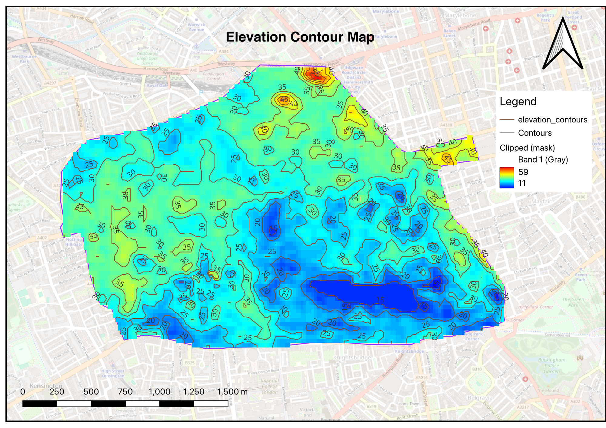

# DRIFT-ramp-up

_Discuss one possible metric that is important to evaluating points of interest (explained in bullet 1 of the alternative approach under "Our Approach") and where we could source the data for this (whether it be a dataset or through scrapping):_

>One possible important metric is the common forms of transportation in the POI. The type of transportation can determine the ability of a disease to spread. For example, a disease >would more likely be spread in an area where buses are the main form of transportation as opposed to personal cars. 
>
>While I don’t exactly know where to find this data, my best guess would be any governmental website dealing with transportation (like Florida DOT) or potentially if Kaggle has any >data sets we can start and experiment with.

# My Map

